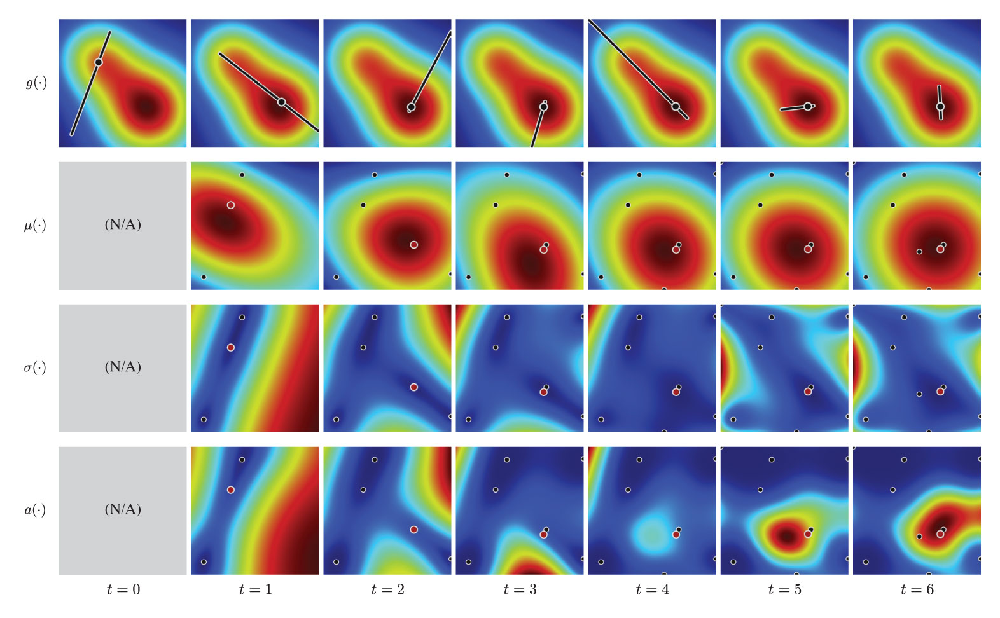
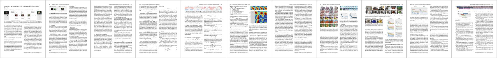

# Sequential Line Search


A C++ library for performing the **sequential line search** method (which is a human-in-the-loop variant of **Bayesian optimization**).



The core algorithm is implemented in `include/sequential-line-search/*.hpp` and `src/*.cpp`. This repository also contains the following example demos:

- **bayesian_optimization_1d**: A simple demo of the standard Bayesian optimization applied to a one-dimensional test function.
- **sequential_line_search_nd**: A simple demo of the sequential line search method applied to a multi-dimensional test function.
- **bayesian_optimization_1d_gui**: A visual demo of the standard Bayesian optimization applied to a one-dimensional test function.
- **bayesian_optimization_2d_gui**: A visual demo of the standard Bayesian optimization applied to a two-dimensional test function.
- **sequential_line_search_2d_gui**: A visual interactive demo of the sequential line search method applied to a two-dimensional test function.
- **sequential_line_search_photo**: A visual interactive demo of the sequential line search method where a photograph is enhanced using six-dimensional parameters.

This library has a [python binding](./python), named `pySequentialLineSearch`.

## Project Web Site

<https://koyama.xyz/project/sequential_line_search/>

## Publication

Yuki Koyama, Issei Sato, Daisuke Sakamoto, and Takeo Igarashi. 2017. Sequential Line Search for Efficient Visual Design Optimization by Crowds. ACM Trans. Graph. 36, 4, pp.48:1--48:11 (2017). (a.k.a. Proceedings of SIGGRAPH 2017)
DOI: https://doi.org/10.1145/3072959.3073598



## Dependencies

### Required for Core Algorithms

- Eigen <http://eigen.tuxfamily.org/> (`brew install eigen` / `sudo apt install libeigen3-dev`)
- NLopt <https://nlopt.readthedocs.io/> (included via gitsubmodule)
- timer <https://github.com/yuki-koyama/timer> (included via gitsubmodule)
- mathtoolbox <https://github.com/yuki-koyama/mathtoolbox> (included via gitsubmodule)
- nlopt-util <https://github.com/yuki-koyama/nlopt-util> (included via gitsubmodule)
- parallel-util <https://github.com/yuki-koyama/parallel-util> (included via gitsubmodule)

### Required for Command Line Demos

- (None)

To build these demos, the CMake variable: `SEQUENTIAL_LINE_SEARCH_BUILD_COMMAND_DEMOS` should be set `ON`.

### Required for Visual Demos

- Qt5 <http://doc.qt.io/qt-5/> (`brew install qt` / `sudo apt install qt5-default`)
- rand-util <https://github.com/yuki-koyama/rand-util> (included via gitsubmodule)
- tinycolormap <https://github.com/yuki-koyama/tinycolormap> (included via gitsubmodule)

To build these demos, the CMake variable: `SEQUENTIAL_LINE_SEARCH_BUILD_VISUAL_DEMOS` should be set `ON`.

### Required for Photo Enhancement Demos

- Qt5 <http://doc.qt.io/qt-5/> (`brew install qt` / `sudo apt install qt5-default`)
- enhancer <https://github.com/yuki-koyama/enhancer> (included via gitsubmodule)
- tinycolormap <https://github.com/yuki-koyama/tinycolormap> (included via gitsubmodule)

To build these demos, the CMake variable: `SEQUENTIAL_LINE_SEARCH_BUILD_PHOTO_DEMOS` should be set `ON`. They require runtime environments to support OpenGL 3.2 Core Profile and GLSL 3.3.

### Required for Experimental Python Binding

- pybind11 <https://github.com/pybind/pybind11> (included via gitsubmodule)

To enable python binding, the CMake variable: `SEQUENTIAL_LINE_SEARCH_BUILD_PYTHON_BINDING` should be set `ON`.

## How to Compile and Run (C++)

We use [cmake](https://cmake.org/) for managing the source codes. You can compile the core module and the demo applications at once by, for example,
```bash
git clone https://github.com/yuki-koyama/sequential-line-search.git --recursive
cd sequential-line-search
mkdir build
cd build
cmake ../
make
```
Then you can run the applications by, for example,
```
./demos/sequential_line_search_nd/SequentialLineSearchNd
```

We tested on macOS (10.15) only. We are aware that the visual demos cannot be built as it is in other OSs; some OpenGL paths etc. need to be resolved. Pull requests welcome.

## How to Install (Python)

`pySequentialLineSearch` is a subset of Python bindings of the C++ library. Tested on Python `3.6`, `3.7`, and `3.8`.

It can be installed via PyPI:
```bash
pip install git+https://github.com/yuki-koyama/sequential-line-search
```

### Prerequisites

macOS
```
brew install cmake eigen
```

Ubuntu 16.04/18.04
```
sudo apt install cmake libeigen3-dev
```

## Examples

Note: User interaction part is omitted from these examples.

### C++

```c++
#include <iostream>
#include <sequential-line-search/sequential-line-search.hpp>

using Eigen::VectorXd;
using sequential_line_search::SequentialLineSearchOptimizer;

double AskHumanForSliderManipulation(const std::pair<VectorXd, VectorXd>& slider_ends)
{
    // ...
    // ...

    return slider_position;
}

int main()
{
    // Instantiate an optimizer
    constexpr int dim = 6;
    SequentialLineSearchOptimizer optimizer(dim);

    // Iterate optimization steps
    constexpr int num_iters = 15;
    for (int i = 0; i < num_iters; ++i)
    {
        // Retrieve a slider space
        const std::pair<VectorXd, VectorXd> slider_ends = optimizer.GetSliderEnds();

        // Query slider manipulation
        const double slider_position = AskHumanForSliderManipulation(slider_ends);

        // Feed the slider manipulation result to the optimizer
        optimizer.SubmitLineSearchResult(slider_position);
    }

    // Display the found solution
    std::cout << optimizer.GetMaximizer() << std::endl;

    return 0;
}
```

### Python

```python
import pySequentialLineSearch
import numpy

def ask_human_for_slider_manipulation(slider_ends):
    # ...
    # ...

    return slider_position

def main():
    optimizer = pySequentialLineSearch.SequentialLineSearchOptimizer(6)

    for i in range(15):
        slider_ends = optimizer.get_slider_ends()
        slider_position = ask_human_for_slider_manipulation(slider_ends)
        optimizer.submit_line_search_result(slider_position)

    print(optimizer.get_maximizer())

if __name__ == '__main__':
    main()
```

## Technical Details

### Gaussian Process Kernel

- ARD Matern 5/2 kernel (default; recommended in [Snoek et al. NIPS 2011])
- ARD squared exponential kernel (used in [Koyama et al. SIGGRAPH 2017])

### Gaussian Process Kernel Hyperparameters

The optimizer API takes a boolean named `use_map_hyperparameters` as input. If this is `true`, the optimizer calculates the kernel hyperparameters for every iteration via the MAP estimation, as described in [Koyama et al. SIGGRAPH 2017]. If this is `false`, the optimizer just uses default values, making the optimization more efficient.

### Finding Maximizer of Acquisition Function

Finding the global maximizer of the acquisition function is a difficult problem since it often has multiple local maxima and is high-dimensional.

This implementation offers two approaches for this problem:

- The first option is to perform DIRECT (a derivative-free global optimization algorithm) and then refine the solution using L-BFGS (a gradient-based local optimization algorithm).
- The second option is to perform L-BFGS multiple times with many different initial solutions and then pick up the best solution.

See `src/acquisition-function.cpp` for details.

### Acquisition Function Choices

The following acquisition functions are supported:

- Expected improvement (EI) [default; used in the original paper]
- Gaussian process upper confidence bound (GP-UCB)

### Search Space

This implementation assumes that the search space is always [0, 1]^D. When you want to handle a different search space, you need to normalize the target space into [0, 1]^D manually.

### Construction of Slider Space

A slider space is constructed by choosing two end points. One of the two end points is always selected by maximizing the acquisition function (i.e., x^{EI} when using EI as the acqusition function). The other end point is selected by one of the following options:

- The point that provides the largest expected value (i.e., x^{+}) [default; used in the original paper]
- The point that is selected in the last subtask (i.e., x^{chosen})

## License

MIT License.

## Contributing

Issue reports, suggestions, requests, and PRs are highly welcomed.

## Contact

Yuki Koyama (<yuki@koyama.xyz>)
